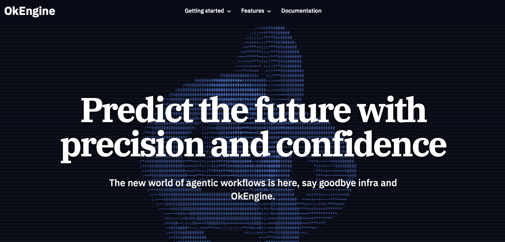

# OkeLanding

A modern, responsive landing page for OkeLanding - a compelling landing page.



## Features

- **Responsive Design**: Fully responsive layout that works on all devices
- **Modern UI**: Clean, professional design with smooth animations
- **Retro 8-bit Icons**: NES.css integration providing nostalgic, pixel-art style icons throughout the interface
- **ASCII Art Animation**: Eye-catching Three.js powered ASCII animation in the hero section with blue text
- **Animated Code Examples**: Transparent code blocks with dynamic ASCII art backgrounds
- **Typewriter Effect**: Animated typewriter effect for product titles using the TypewriterLogo component
- **OkDash Video Showcase**: Embedded video demonstration of the OkDash product capabilities
- **Streamlined Navigation**: Centered navigation menu with small, white text buttons and hover effects
- **Product Overview Section**: "What is OkEngine?" section with title on the right and content on the left
- **Problem vs. Solution Comparison**: Two-column layout comparing traditional BI struggles with OkEngine solutions
- **Value Proposition Billboard**: Eye-catching section with large headline and four key benefits
- **Elegant Typography**: IBM Plex Serif font for all body text enhancing readability and visual appeal
- **Performance Optimized**: Fast loading times and optimized assets
- **SEO Friendly**: Proper semantic HTML structure
- **Accessibility**: WCAG compliant design elements

## Technologies Used

- **React**: UI library for building component-based interfaces
- **TypeScript**: Type-safe JavaScript for better developer experience
- **Vite**: Fast, modern frontend build tool
- **Tailwind CSS**: Utility-first CSS framework
- **Motion**: Animation library for smooth transitions 
- **Three.js**: 3D graphics library for creating the ASCII art animation

## Getting Started

### Prerequisites

- Node.js (v16 or higher)
- npm or yarn

### Installation

1. Clone the repository:
   ```bash
   git clone https://github.com/your-organization/okelanding.git
   cd okelanding
   ```

2. Install dependencies:
   ```bash
   npm install
   # or
   yarn install
   ```

3. Start the development server:
   ```bash
   npm run dev
   # or
   yarn dev
   ```

4. Open your browser and navigate to `http://localhost:5173`

## Project Structure

```
okelanding/
├── public/              # Static assets
├── src/                 # Source files
│   ├── components/      # React components
│   │   └── ui/          # UI components
│   ├── App.tsx          # Main application component
│   ├── main.tsx         # Application entry point
│   └── styles.css       # Global styles
├── lib/                 # Utility functions
├── index.html           # HTML template
├── package.json         # Project dependencies
├── tsconfig.json        # TypeScript configuration
├── vite.config.js       # Vite configuration
└── tailwind.config.js   # Tailwind CSS configuration
```

## Available Scripts

- `npm run dev` - Start the development server
- `npm run build` - Build the project for production
- `npm run preview` - Preview the production build locally

## Design System

The project follows a comprehensive style guide that defines colors, typography, spacing, and component styles. Refer to the `style_guide.md` file for detailed design specifications.

## Browser Support

- Chrome (latest)
- Firefox (latest)
- Safari (latest)
- Edge (latest)

## Contributing

1. Fork the repository
2. Create your feature branch (`git checkout -b feature/amazing-feature`)
3. Commit your changes (`git commit -m 'Add some amazing feature'`)
4. Push to the branch (`git push origin feature/amazing-feature`)
5. Open a Pull Request

## License

This is proprietary software. All rights reserved.

## Acknowledgments

- Design inspiration from modern SaaS landing pages
- Icons from [Heroicons](https://heroicons.com/)
